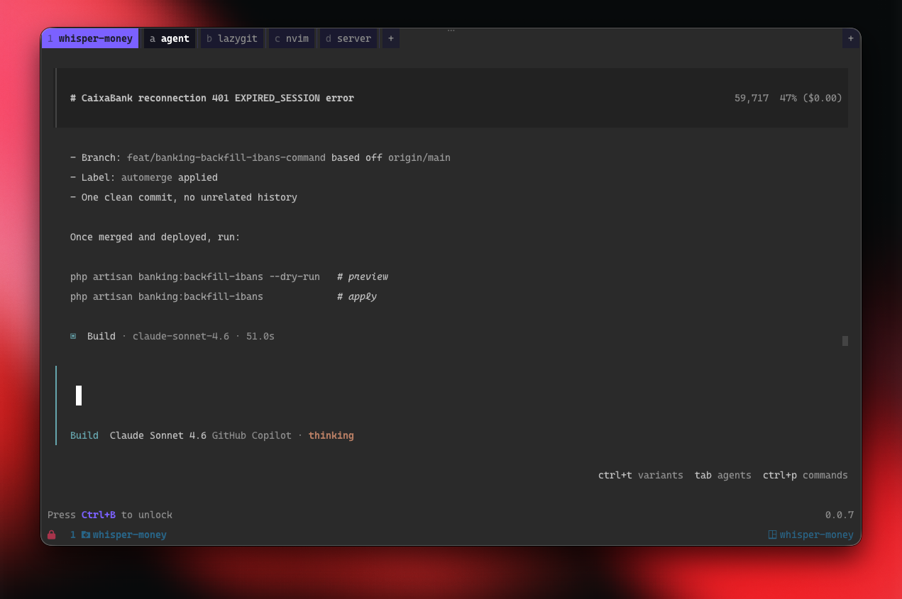

# falcode

A terminal multiplexer for multi-agent git worktree workflows.

Each outer tab (workspace) maps to a git worktree discovered in the current repository. Each workspace has inner tabs that run configurable tools — AI coding agent, lazygit, or an interactive shell — each in its own PTY. The workflow it enables: one worktree per feature branch, each with its own agent running in parallel.



---

[](https://github.com/whisper-money/whisper-money)

falcode is built to power the development of [Whisper Money](https://github.com/whisper-money/whisper-money) — a privacy-first, self-hosted personal finance app.

---

## Installation

### Homebrew (macOS / Linux)

```sh
brew install victor-falcon/falcode/falcode
```

### go install

```sh
go install github.com/victor-falcon/falcode@latest
```

### Download binary

Download the latest pre-built binary for your platform from the [GitHub Releases](https://github.com/victor-falcon/falcode/releases) page, extract it, and move it to a directory in your `$PATH`.

## Usage

Run from inside any git repository:

```sh
falcode
```

falcode discovers all git worktrees in the repository and opens one workspace tab per worktree. Each workspace starts with the configured inner tabs (Agent, Git, Console by default).

Mouse clicks on tabs are supported in addition to keybinds.

When a command tab (Agent, Git) exits, a restart banner appears at the bottom of the pane — press `Enter` to relaunch it.

## Default Keybinds

The default prefix key is `Ctrl+B` (tmux-style). Press the prefix to enter command mode, then:

| Sequence | Action |
|----------|--------|
| `Ctrl+B` `q` | Quit (press `y` to confirm, any other key to cancel) |
| `Ctrl+B` `Ctrl+B` | Send prefix key through to the active pane |
| `Ctrl+B` `1`–`9` | Jump directly to workspace 1–9 |
| `Ctrl+B` `a`–`z` | Jump directly to inner tab a–z |
| **t — Tabs** | |
| `Ctrl+B` `t` `l` | Next inner tab |
| `Ctrl+B` `t` `h` | Previous inner tab |
| `Ctrl+B` `t` `n` | New console tab |
| `Ctrl+B` `t` `r` | Rename current tab |
| `Ctrl+B` `t` `x` | Close current tab |
| **w — Workspaces** | |
| `Ctrl+B` `w` `l` | Next workspace |
| `Ctrl+B` `w` `h` | Previous workspace |
| `Ctrl+B` `w` `n` | Create new workspace |
| `Ctrl+B` `w` `x` | Delete current workspace |
| **u — UI** | |
| `Ctrl+B` `u` `a` | Toggle appearance (dark / light) |

Press `Esc` at any point to cancel the current prefix sequence and return to normal mode.

Navigation keys (`l` / `h`) keep you in the sub-layer so you can press them repeatedly without re-entering the prefix. Structural actions (`n` / `x`) automatically return to normal mode after executing.

The numeric/letter prefix shown on each workspace and inner tab label corresponds to its direct-jump key — press `Ctrl+B` then that key to jump straight to it.

## Configuration

falcode reads **both** config files and merges them — the project-local file layers on top of the user-global one:

| Priority | Path | Purpose |
|----------|------|---------|
| 1 (top) | `<repo>/falcode.json` | Project-local overrides, checked into the repo |
| 2 | `~/.config/falcode/config.json` | User-global settings |
| 3 | Built-in defaults | Used when a field is absent from both files |

Each field is resolved independently: a repo-level value overrides the global value, which overrides the built-in default. Neither file is required to define `tabs` — omitting them simply inherits from the next level.

To bootstrap a user config file:

```sh
falcode write-default-config
```

This writes the built-in defaults to `~/.config/falcode/config.json` which you can then edit.

### config.json

```json
{
  "tabs": [
    { "name": "Agent", "command": "opencode" },
    { "name": "Git",   "command": "lazygit" },
    { "name": "Console" }
  ],
  "worktree_scripts": ["falcode.sh", "worktree.sh"],
  "ui": {
    "theme": "default",
    "theme_scheme": "system",
    "hide_footer": false,
    "new_tab_button": true,
    "new_workspace_button": true,
    "close_tab_button": "focus",
    "close_workspace_button": "none",
    "compact_tabs": false,
    "show_workspace_numbers": true,
    "show_tab_numbers": true
  },
  "keybinds": {
    "prefix": "ctrl+b",
    "bindings": []
  }
}
```

Tabs with no `"command"` run an interactive `$SHELL`.

### Project-local config (`falcode.json`)

Drop a `falcode.json` at the root of any repository to layer project-specific settings on top of your global config. Only the fields you specify are overridden — everything else keeps its global or default value.

#### `appended_tabs`

`appended_tabs` adds extra inner tabs after the tabs already resolved from the global config (or `tabs` if you also override those). This is the primary use case for a repo-level `falcode.json`: extend the standard tab set with tools specific to that project.

```json
{
  "appended_tabs": [
    { "name": "Tests", "command": "watchexec -e go -- go test ./..." },
    { "name": "Logs" }
  ]
}
```

With the global config providing `Agent`, `Git`, and `Console`, the above produces four inner tabs: `Agent`, `Git`, `Console`, `Tests`, `Logs`.

You can combine `appended_tabs` with other overrides in the same file:

```json
{
  "appended_tabs": [
    { "name": "Tests", "command": "watchexec -e go -- go test ./..." }
  ],
  "ui": {
    "theme": "myproject"
  }
}
```

### Worktree scripts

`worktree_scripts` is an ordered list of relative paths that falcode searches for a setup script whenever a new workspace (worktree) is created.

```json
{ "worktree_scripts": ["falcode.sh", "worktree.sh"] }
```

**Default:** `["falcode.sh", "worktree.sh"]`

When a new workspace is created, falcode looks for each path in sequence relative to the new worktree directory and executes the first one that exists. If none of the listed files are found, no script is run.

The script runs with its working directory set to the new worktree root, so you can use relative paths freely. Use it to automate per-worktree setup — installing dependencies, running migrations, copying environment files, and so on.

**Example** — place a `falcode.sh` in your repo root:

```sh
#!/bin/sh
npm install
cp .env.example .env.local
```

Because the default list checks `falcode.sh` before `worktree.sh`, you can use `falcode.sh` for project-specific setup that should only run inside falcode, while keeping `worktree.sh` for general setup scripts shared with other tools.

### UI options

| Option | Values | Default | Description |
|--------|--------|---------|-------------|
| `theme` | string | `"default"` | Name of the theme to load from `~/.config/falcode/themes/` |
| `theme_scheme` | `"system"` `"dark"` `"light"` | `"system"` | Color scheme — `"system"` detects macOS appearance at launch |
| `hide_footer` | bool | `false` | Hide the bottom status/hint bar |
| `new_tab_button` | bool | `true` | Show the `[+]` new-tab button in the inner tab bar |
| `new_workspace_button` | bool | `true` | Show the `[+]` new-workspace button in the workspace bar |
| `close_tab_button` | `"all"` `"focus"` `"none"` | `"focus"` | Show `[x]` close button on all tabs, only the focused one, or none |
| `close_workspace_button` | `"all"` `"focus"` `"none"` | `"none"` | Show `[x]` close button on workspace tabs |
| `compact_tabs` | bool | `false` | Merge the workspace bar and inner tab bar into a single row |
| `show_workspace_numbers` | bool | `true` | Prefix each workspace label with its 1-based index (e.g. `1 main`), matching the default `1`–`9` direct-jump keybinds |
| `show_tab_numbers` | bool | `true` | Prefix each inner tab label with its keybind letter (e.g. `a Agent`), matching the default `a`–`z` direct-jump keybinds |

#### Notifications

Sound and OS notifications fired when an agent changes state. Configured as a root-level `notifications` key:

```json
{ "notifications": { "sound_on_idle": true, "sound_on_permission": true, "notify_on_idle": true, "notify_on_permission": true, "notify_on_question": true } }
```

| Option | Default | Description |
|--------|---------|-------------|
| `sound_on_idle` | `true` | Play a sound when the agent finishes its turn (`✓`) or asks a question (`?`) |
| `sound_on_permission` | `true` | Play a sound when the agent is waiting for a permission grant (`!`) |
| `notify_on_idle` | `true` | Show an OS notification when the agent finishes its turn or answers a question |
| `notify_on_permission` | `true` | Show an OS notification when the agent is waiting for a permission grant |
| `notify_on_question` | `true` | Show an OS notification when the agent is waiting for a user reply |
| `provider` | `"osascript"` | Notification backend: `"osascript"` (built-in, no dependencies) or `"terminal-notifier"` (requires `brew install terminal-notifier`; falls back to `osascript` if not found) |
| `activate_app` | `""` | macOS bundle ID to bring to the foreground when the notification is clicked. Only used with `terminal-notifier` (e.g. `"com.mitchellh.ghostty"`) |

### Keybinds

Keybinds live under the `"keybinds"` key in `config.json`. The full structure:

```json
{
  "keybinds": {
    "prefix": "ctrl+b",
    "bindings": [
      { "key": "q", "description": "Quit", "action": "quit" },
      {
        "key": "t", "description": "Tab",
        "bindings": [
          { "key": "l", "description": "Next tab",     "action": "next_tab" },
          { "key": "h", "description": "Prev tab",     "action": "prev_tab" },
          { "key": "n", "description": "New console",  "actions": ["new_tab", "lock"] },
          { "key": "r", "description": "Rename tab",   "actions": ["rename_tab", "lock"] },
          { "key": "x", "description": "Close tab",    "actions": ["close_tab", "lock"] }
        ]
      },
      {
        "key": "w", "description": "Workspace",
        "bindings": [
          { "key": "l", "description": "Next workspace",   "action": "next_workspace" },
          { "key": "h", "description": "Prev workspace",   "action": "prev_workspace" },
          { "key": "n", "description": "New workspace",    "actions": ["new_workspace", "lock"] },
          { "key": "x", "description": "Delete workspace", "actions": ["delete_workspace", "lock"] }
        ]
      },
      {
        "key": "u", "description": "UI",
        "bindings": [
          { "key": "a", "description": "Toggle appearance", "actions": ["toggle_scheme", "lock"] }
        ]
      }
    ]
  }
}
```

Available action names: `quit`, `next_tab`, `prev_tab`, `new_tab`, `close_tab`, `rename_tab`, `next_workspace`, `prev_workspace`, `new_workspace`, `delete_workspace`, `passthrough`, `go_to_tab`, `go_to_workspace`, `toggle_scheme`, `lock`.

The `lock` action exits command mode. Omit it from navigation bindings to stay in the sub-layer and press the key repeatedly.

Use `"action"` for a single action or `"actions"` to chain multiple actions.

#### Direct jump bindings (`go_to_workspace` / `go_to_tab`)

The `go_to_workspace` and `go_to_tab` actions accept a `"params"` object with an `"index"` field (0-based):

```json
{ "key": "1", "description": "Workspace 1", "action": "go_to_workspace", "params": { "index": 0 } }
{ "key": "a", "description": "Tab a",        "action": "go_to_tab",        "params": { "index": 0 } }
```

These are included in the default keybinds as keys `1`–`9` (workspaces) and `a`–`z` (inner tabs). The tab-bar labels automatically reflect the key that will activate them — changing the binding key in your config will update the displayed prefix accordingly.

#### Which-key overlay: `sheet_key` and `sheet_hide`

When many bindings share a pattern (like `1`–`9`), you can collapse them into a single representative row in the which-key overlay:

```json
{ "key": "1", "description": "Go to workspace", "action": "go_to_workspace", "params": { "index": 0 }, "sheet_key": "1-9" },
{ "key": "2", "description": "Go to workspace", "action": "go_to_workspace", "params": { "index": 1 }, "sheet_hide": true },
...
```

| Field | Type | Description |
|-------|------|-------------|
| `sheet_key` | string | Overrides the key label shown in the which-key overlay for this binding (e.g. `"1-9"`) |
| `sheet_hide` | bool | When `true`, omits this binding from the which-key overlay entirely |

## Themes

falcode ships with a built-in dark-purple theme. You can create and share custom themes as plain JSON files.

### Create a custom theme

1. Export the built-in theme as a starting point:

   ```sh
   falcode write-default-theme mytheme
   ```

   This writes `~/.config/falcode/themes/mytheme.json`.

2. Edit the file — change any color values you want. Colors are `#RRGGBB` hex strings or named aliases defined in the `"defs"` block. Use `"transparent"` to inherit the terminal background.

3. Activate it in `config.json`:

   ```json
   { "ui": { "theme": "mytheme" } }
   ```

### Theme file format

```json
{
  "defs": {
    "accent": "#7B61FF",
    "accent_dim": "#5B41DF"
  },
  "colors": {
    "workspace_active":    { "dark": "accent",    "light": "accent_dim" },
    "workspace_active_fg": { "dark": "#FFFFFF",   "light": "#FFFFFF" },
    "inner_active":        { "dark": "accent",    "light": "accent_dim" }
  }
}
```

Each color token requires both `"dark"` and `"light"` values. Omitted tokens fall back to the built-in defaults. The full list of color tokens and their descriptions is in [`internal/config/themes/schema.json`](internal/config/themes/schema.json).

#### Agent status icon colors

These tokens control the foreground color of the icons shown in workspace tabs when an agent is running:

| Token | Default (dark) | Default (light) | Icon | Meaning |
|-------|---------------|-----------------|------|---------|
| `agent_working_fg` | `#5FFF87` | `#FFFFFF` | spinner | Agent is actively processing |
| `agent_permission_fg` | `#FF5F5F` | `#CC2222` | `!` | Agent awaiting a permission grant |
| `agent_question_fg` | `#FF8C00` | `#C05800` | `?` | Agent asking the user a question |
| `agent_done_fg` | `#5FFF87` | `#FFFFFF` | `✓` | Agent finished its turn |

### Share a theme

Themes are self-contained JSON files — share them however you like (gist, repo, etc.). Users drop the file into `~/.config/falcode/themes/` and set `"theme": "<filename-without-extension>"` in their config.

## Contributing

1. Fork the repository
2. Clone your fork: `git clone https://github.com/<you>/falcode`
3. Build: `go build -o falcode .`
4. Make your changes and verify the build still works
5. Open a pull request against `main`

Bug reports and feature requests are welcome as GitHub Issues.
